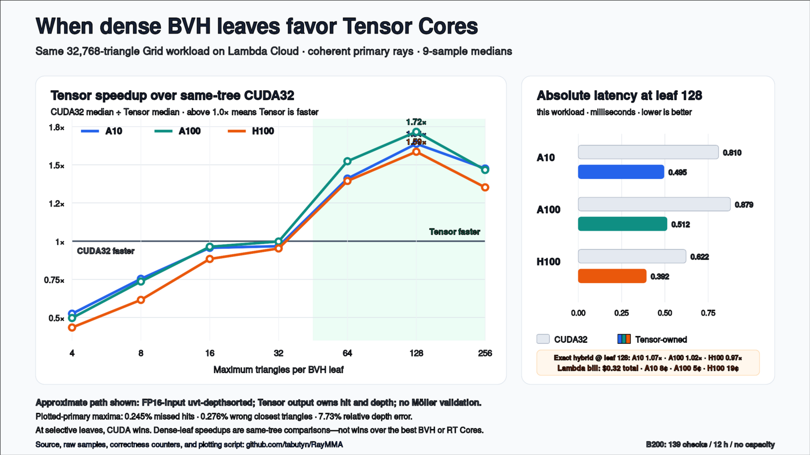

# Findings and evidence

## Verdict

RayMMA does not show that Tensor Cores are generally faster for ray tracing.
It shows a narrower systems result: dense ray/triangle candidate batches can
benefit from WMMA, while a selective BVH plus ordinary CUDA32
Möller–Trumbore remains the fastest complete configuration tested.

## Paid Lambda A10 archive run

On July 21, 2026, the public repository was cloned and built on a paid Lambda
Cloud `gpu_1x_a10` rental. The run used an NVIDIA A10 (compute 8.6), CUDA
12.8.93, the procedural 32,768-triangle Grid, 256x144 rays, six warmups, nine
retained samples, and maximum leaf sizes from 4 through 256. All 16 tests and
the remote archive runner passed. The verified result archive was downloaded
before the Lambda API confirmed termination. Runtime through confirmed
termination was 9.3 minutes; the launch price was $1.29/hour and the helper's
conservative wall-clock estimate was $0.21. Lambda's billing history records
an actual charge of $0.08.

The A10 result strengthens the narrow conclusion rather than reversing it.
The exact `validated` hybrid beat same-tree CUDA32 only for coherent primary
rays at leaf 128 (1.075x) and leaf 256 (1.044x). It lost for shuffled primary
rays and every measured secondary-ray case. With selective leaves, CUDA32
Möller–Trumbore remained clearly faster.

The no-Möller Tensor-owned modes crossed over more strongly when the BVH was
made deliberately dense. Their best median integrated results were:

| Workload | `uvt-depthsorted` | `e0e1e2` |
|---|---:|---:|
| Primary, coherent | 1.638x at leaf 128 | 1.628x at leaf 128 |
| Primary, shuffled | 0.955x at leaf 128 | 0.964x at leaf 128 |
| Secondary, pixel-ordered | 1.307x at leaf 64 | 1.305x at leaf 64 |
| Secondary, shuffled | 1.229x at leaf 128 | 1.223x at leaf 128 |

Those approximate paths had low but nonzero disagreement. Across the A10
archive, maximum false-negative rates ranged up to 0.4710% of reference hits
and maximum wrong-primitive rates ranged up to 0.7849%. The exact maxima per
variant and ray set, every raw timing sample, complete console transcripts,
environment, tests, source hashes, executables, and the original verified
archive are retained in the
[Lambda A10 evidence bundle](../results/lambda-a10-2026-07-21/README.md).

## Paid Lambda H100 archive run

Later on July 21, 2026, the same archive suite ran on a Lambda Cloud NVIDIA
H100 80GB HBM3 at compute capability 9.0. All 16 tests passed, the verified
archive was retrieved, termination was confirmed, and a separate inventory
query showed no running instances. The measured lifecycle was 7.4 minutes at
a launch price of $4.29/hour. The helper's conservative wall-clock estimate
was $0.57; Lambda's billing history records an actual charge of $0.19.

The exact result was stricter than on A10: `validated` did not beat integrated
CUDA32 in any primary or secondary configuration. Its best speedup was 0.968x
for coherent primary rays at leaf 128. The approximate modes reached about
1.59x for coherent primary rays, 1.19x for shuffled primary rays, and 1.12x
for ordered secondary rays at dense leaves. Accuracy disagreement remained
small but nonzero, with the same maximum rates reported in the A10 procedural
Grid run.

The complete [Lambda H100 evidence bundle](../results/lambda-h100-2026-07-21/README.md)
contains all raw samples, transcripts, tests, environment and source
provenance, executables, checksums, and the original verified archive.

## Paid Lambda A100 archive run

The third successful July 21 cloud run used an NVIDIA A100-SXM4-40GB at compute
capability 8.0. All 16 tests passed, the archive was downloaded and verified,
termination was confirmed, and a separate inventory query reported no running
instances. The measured lifecycle was 10.2 minutes at $1.99/hour. The helper's
conservative wall-clock estimate was $0.36; Lambda's billing history records
an actual charge of $0.05.

The exact `validated` hybrid crossed integrated CUDA32 only once: 1.024x for
coherent primary rays at leaf 128. It remained slower for shuffled primary
rays and all secondary-ray cases. Approximate modes reached 1.72x coherent
primary, 1.17x shuffled primary, and 1.19x ordered secondary at dense leaves.

The complete [Lambda A100 evidence bundle](../results/lambda-a100-2026-07-21/README.md)
retains every raw sample and correctness counter alongside the environment,
tests, source hashes, executables, checksums, and original verified archive.

## Cross-GPU crossover and cost

The graph uses the most legible apples-to-apples slice of the cloud archives:
coherent primary rays over the procedural 32,768-triangle Grid,
`uvt-depthsorted`, and the median of nine integrated samples. The benchmark
source, runner, and workload hashes match across the three rentals. Speedup is
same-GPU, same-tree CUDA32 time divided by Tensor time; it is not a ratio of
one GPU model to another.

The approximate no-Möller Tensor median remained at or below parity through a
maximum leaf size of 32 on every GPU; A100 at leaf 32 was a near tie at
0.998x, with overlapping sample ranges. It crossed over at leaf 64 on all
three and peaked at leaf 128: 1.638x on A10, 1.716x on A100, and 1.586x on
H100. At that same leaf size, absolute Tensor-path medians were 0.495 ms,
0.512 ms, and 0.392 ms respectively. These small 256x144 trace kernels are
useful algorithm comparisons, not general GPU rankings.

For the plotted primary-ray variant, the archived maxima were 0.2452% false
negatives, 0.2758% wrong primitives, and 7.73% relative depth error. The
archive-wide maxima were 0.4710% false negatives, 0.7849% wrong primitives,
and 242% relative depth error. That last maximum occurred in a secondary case
that also reported wrong primitives; the aggregate counter does not establish
that the same ray caused both. That case's maximum absolute depth difference
was 0.113 scene units; the archive-wide maximum absolute difference was 0.547
in a primary `e0e1e2` case. These are worst cases, not typical errors. The
broader maxima come from secondary rays and both approximate variants and are
not silently attributed to the plotted curve.

The exact result remains less dramatic. At leaf 128, the validated hybrid was
1.075x on A10, 1.024x on A100, and 0.968x on H100. Across all tested leaves it
won only narrowly on A10/A100 and never on H100. A selective BVH plus CUDA32
Möller–Trumbore remained the fastest complete configuration.

The provider-reported bill for all three successful Lambda runs was **$0.32**:

| GPU | Live rate | Displayed billed duration | Actual charge |
|---|---:|---:|---:|
| A10 | $1.29/hour | 0.07 hour | $0.08 |
| A100 | $1.99/hour | 0.03 hour | $0.05 |
| H100 | $4.29/hour | 0.05 hour | $0.19 |

The displayed durations and charges come from Lambda's billing history and
may be independently rounded. The automation's earlier $1.14 combined
estimate multiplied each full launch-to-confirmed-termination wall-clock
lifecycle by its live rate, so it also counted provisioning, readiness,
archive retrieval, and termination polling. The provider charge is the
authoritative experiment cost.

The [SVG](assets/cloud-gpu-crossover.svg),
[derived comparison CSV](../results/cloud-gpu-comparison-2026-07-21.csv),
[plotting script](../tools/plot_cloud_comparison.py), and original per-sample
CSVs are retained so the figure can be inspected and regenerated.

## B200 overnight availability result

From July 21 at 18:58 NDT through July 22 at 06:58 NDT, the unattended watcher
completed a 12-hour wall-clock window with 139 successful Lambda API checks.
No eligible single-GPU B200 capacity appeared. No instance was launched, no
B200 compute charge was incurred, and there is no B200 benchmark result.

This documents inability to obtain the requested GPU, not a performance
finding. The [B200 availability record](../results/lambda-b200-availability-2026-07-21/README.md)
retains the exact window, final state, restrictions, and polling caveat.

## RTX 3050 Ti Coastal Cliff reproduced result

The current standalone source was rebuilt with CUDA 13.1 and the hash-pinned,
CC0 Poly Haven Coastal Cliff 01 model. The model produced 8,516, 71,312, and
461,824-triangle tiers. All 15 tests passed.

The benchmark used 256x144 rays, six internal warmups, nine retained
CUDA-event samples, and a separate candidate-rich Grid run immediately before
each recorded process to bring the laptop GPU out of its idle clock state.

At a selective maximum leaf size of 16, CUDA32 beat the validated and
Tensor-owned paths in every Coastal Cliff primary comparison. CUDA32 also beat
the validated path for every measured secondary-ray comparison.

At a deliberately dense maximum leaf size of 256, the exact validated hybrid
beat same-tree CUDA32 in three of six comparisons:

| Scene | Order | CUDA32 | Validated WMMA | CUDA32 / WMMA |
|---|---|---:|---:|---:|
| Low | coherent | 0.6963 ms | 0.7373 ms | 0.944x |
| Low | shuffled | 0.6060 ms | 0.6255 ms | 0.969x |
| Mid | coherent | 1.7406 ms | 1.7080 ms | 1.019x |
| Mid | shuffled | 1.0854 ms | 0.9532 ms | 1.139x |
| High | coherent | 2.8140 ms | 3.0515 ms | 0.922x |
| High | shuffled | 1.1387 ms | 1.0043 ms | 1.134x |

The High leaf sweep found the fastest CUDA32 medians at 0.3267 ms coherent
and 0.3031 ms shuffled. The leaf-256 validated path was therefore about 9.3x
and 3.3x slower than the best selective CUDA32 configuration despite one
same-tree crossover.

The Tensor-owned modes remove every Möller check and use Tensor-derived depth
for closest-hit ordering and BVH clipping. On Coastal Cliff High at leaf 256:

| Variant | Order | CUDA32 / Tensor | Misses | Wrong primitive | Max relative depth error |
|---|---|---:|---:|---:|---:|
| `uvt-depthsorted` | coherent | 1.075x | 2 | 3 | 1.65% |
| `uvt-depthsorted` | shuffled | 1.292x | 2 | 3 | 1.65% |
| `e0e1e2` | coherent | 1.064x | 3 | 5 | 3.28% |
| `e0e1e2` | shuffled | 1.299x | 3 | 5 | 3.28% |

These are approximate throughput wins against the same dense tree, not exact
best-renderer wins. The complete
[benchmark bundle](../results/rtx3050ti-coastal-cliff-2026-07-21/README.md)
contains the raw samples, full transcripts, environment, tests, checksums, and
source manifest.

## What this means

- BVH selectivity saved more work than WMMA accelerated in the best complete
  configuration.
- Dense candidate work can amortize Tensor Core setup and make both exact
  hybrid and approximate Tensor-owned kernels competitive with the same-tree
  CUDA path.
- Removing FP32 Möller validation improves throughput but makes hit, primitive,
  and depth error part of the result.
- Packet order materially changes traversal and batching costs.

## Scope

This is a software BVH comparison on an RTX 3050 Ti Laptop GPU plus paid
NVIDIA A10, A100, and H100 rentals. A 12-hour B200 availability watch found no
capacity, so B200 remains unmeasured. The strongest
implemented baseline is independent-ray CUDA32; the repository does not
compare against RT Cores, OptiX, Vulkan RT, or DXR. Results on other GPU
generations remain useful future measurements.

See [Reproducibility](REPRODUCIBILITY.md) for the timing and correctness
contract.
