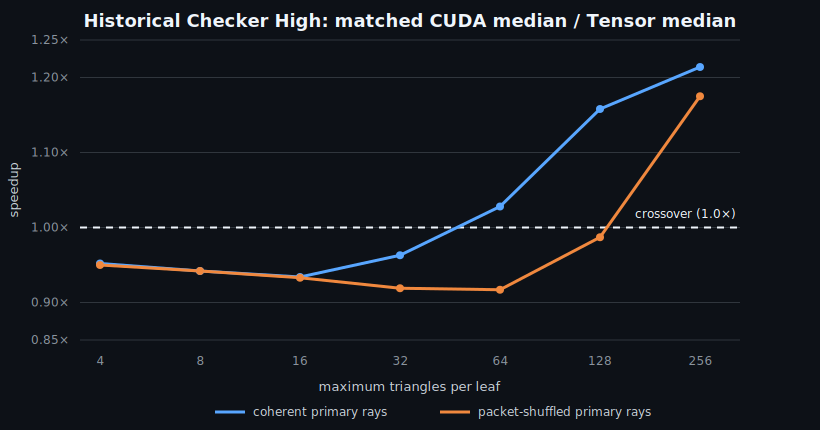

# Historical RayMMA results on an RTX 3050 Ti

> **Evidence warning:** most tables below have no retained raw samples, exact
> source identity, or scene hashes. The one raw Grid bundle comes from a
> pre-public source tree and compares only the validated hybrid with matched
> CUDA-packet16 (`CUDA16` in its archived output). Use
> [Findings and evidence](RESULTS.md) for the current conclusion.

## Provisional raw matched-packet spot check

The procedural Grid bundle is retained with raw samples in
[`results/rtx3050ti-grid-2026-07-19`](../results/rtx3050ti-grid-2026-07-19/README.md).
At a maximum leaf size of 256, the integrated validated hybrid measured 0.961x
versus matched CUDA-packet16 for coherent rays and 1.047x for packet-shuffled
primary rays. Both passed the checks implemented by that development revision.

That result is narrow, ray-order dependent, and not a CUDA32 comparison. It is
retained only as historical context; current claims use the newer raw bundles.

## Historical exploratory snapshot

The remainder of this document is an exploratory single-GPU snapshot, not a
cross-architecture performance claim. The recorded run predates the release
harness's 16-by-16 image-stratified brute-force sampling; it checked the first
256 rays in each ordering. Raw samples were not retained. The current harness
also fixes a four-triangle leaf-alignment bug and adds FP16 range fallbacks, so
these tables are not used as current release evidence.

## Question

Does the Tensor Core advantage measured with the original coarse
256-triangle-bin BVH survive a stronger acceleration structure,
packet-shuffled primary rays, and standard scenes?

## Harness

`tensor-wide-bvh-bench` is a headless research executable separate from the
interactive lab. It uses:

- a 16-bin surface-area-heuristic builder;
- a binary build tree collapsed to eight-wide nodes;
- tested maximum leaf sizes of 4–256 triangles, with four-triangle-aligned
  starts for WMMA;
- the same BVH, triangle order, rays, FP32 final predicate, and hit output for
  matched CUDA-packet16 and the validated hybrid;
- coherent primary-ray order and an exactly identical ray set shuffled across
  16-ray packets;
- a separate two-kernel mode that first records packet/leaf intersections and
  then times CUDA-packet16 or WMMA leaf processing on the same recorded work;
- integrated-kernel timing, phase timing, workload counters, and nine
  CUDA-event samples with alternating backend order;
- full-image validated-hybrid/CUDA-packet16 comparison plus a 256-ray
  brute-force sample.

The separated traversal deliberately uses an infinite ray bound because no
closest hit is available until the leaf stage. Its `traversal + leaves` total
is therefore a diagnostic, not a faster replacement for integrated traversal.

The standard Sibenik and Sponza OBJs were separately obtained benchmark data.
Their exact hashes were not retained with this snapshot, another reason these
numbers are not release evidence. San Miguel is supported with
`--include-sanmiguel` but was omitted because its 9,963,191 triangles create a
large memory and build-time excursion on this 4 GB laptop GPU.

## Reproduction

```sh
cmake --preset core -DCMAKE_CUDA_ARCHITECTURES=86
cmake --build --preset core --parallel
./build/core/tensor-wide-bvh-bench --quick --scene Grid

cmake --preset core \
  -DRAYMMA_ENABLE_EXTERNAL_SCENES=ON \
  -DRAYMMA_SIBENIK_PATH=/path/to/sibenik.obj \
  -DRAYMMA_SPONZA_PATH=/path/to/sponza.obj
cmake --build --preset core --parallel
./build/core/tensor-wide-bvh-bench
./build/core/tensor-wide-bvh-bench \
  --resolution 512x288 --scene CheckerHigh
./build/core/tensor-wide-bvh-bench \
  --leaf 4 --scene CheckerHigh
./build/core/tensor-wide-bvh-bench \
  --candidate-rich --scene CheckerHigh
./build/core/tensor-wide-bvh-bench \
  --leaf-sweep --scene CheckerHigh
```

Use `--quick` for 128x72 and five samples, or `--scene` with `Grid`,
`CheckerLow`, `CheckerMid`, `CheckerHigh`, `Sibenik`, or `Sponza`.
`--leaf` accepts positive multiples of four. `--candidate-rich` selects 256,
and `--leaf-sweep` runs 4, 8, 16, 32, 64, 128, and 256.

## RTX 3050 Ti results

Historical Release build, driver 590.44.01, 256x144, 36,864 rays, nine
samples. Times are median GPU trace-kernel times; they exclude BVH
construction, Tensor coefficient/local-frame packing, allocation, upload, and
presentation. Speedup is matched CUDA-packet16 time divided by validated-hybrid
time; less than one means the hybrid is slower. This first table uses a maximum
leaf size of 16.

| Scene | Triangles | Ray order | CUDA-packet16 | Validated hybrid | Integrated speedup |
|---|---:|---|---:|---:|---:|
| Grid | 32,768 | coherent | 0.6164 ms | 0.7250 ms | 0.850x |
| Grid | 32,768 | shuffled | 1.3147 ms | 1.4531 ms | 0.905x |
| Checker Low | 8,517 | coherent | 0.3246 ms | 0.3656 ms | 0.888x |
| Checker Low | 8,517 | shuffled | 0.7884 ms | 0.8846 ms | 0.891x |
| Checker Mid | 71,313 | coherent | 0.6410 ms | 0.7025 ms | 0.912x |
| Checker Mid | 71,313 | shuffled | 1.1724 ms | 1.2708 ms | 0.923x |
| Checker High | 824,500 | coherent | 1.1131 ms | 1.1919 ms | 0.934x |
| Checker High | 824,500 | shuffled | 1.5287 ms | 1.6381 ms | 0.933x |
| Sibenik | 73,564 | coherent | 2.1955 ms | 2.4389 ms | 0.900x |
| Sibenik | 73,564 | shuffled | 10.3178 ms | 11.5354 ms | 0.894x |
| Sponza | 262,267 | coherent | 2.9801 ms | 3.3360 ms | 0.893x |
| Sponza | 262,267 | shuffled | 15.4488 ms | 17.1950 ms | 0.898x |

Every full-image CUDA-packet16/validated-hybrid comparison reported zero
hit/miss, primitive, or depth differences. A separate historical brute-force
sample found one shuffled Sibenik ray selecting a different coplanar primitive
at exactly the same depth. The current release gate is strict and would flag
that difference for explicit investigation. No packet-leaf list overflow was
reported.

Smaller, more selective triangle leaves do not reverse the result:

| Scene | Leaf maximum | Ray order | CUDA-packet16 | Validated hybrid | Integrated speedup |
|---|---:|---|---:|---:|---:|
| Checker High | 4 | coherent | 1.3732 ms | 1.4418 ms | 0.952x |
| Checker High | 4 | shuffled | 1.6978 ms | 1.7866 ms | 0.950x |
| Checker High | 8 | coherent | 1.3169 ms | 1.3978 ms | 0.942x |
| Checker High | 8 | shuffled | 1.6138 ms | 1.7140 ms | 0.942x |
| Checker High | 16 | coherent | 1.1131 ms | 1.1919 ms | 0.934x |
| Checker High | 16 | shuffled | 1.5287 ms | 1.6381 ms | 0.933x |

The historical Sponza maximum-4 rows are withdrawn: its non-multiple-of-four
triangle total reached an undefined split case that the release harness now
fixes and regression-tests.

## Candidate-rich maximum-256 leaves

Large leaves deliberately trade BVH selectivity for enough intersection work
to amortize WMMA. They restore a matched-configuration validated-hybrid
advantage:

| Scene | Ray order | BVH8 nodes | Tests / ray | CUDA-packet16 | Validated hybrid | Speedup |
|---|---|---:|---:|---:|---:|---:|
| Checker High | coherent | 1,601 | 23.7 | 3.5164 ms | 2.8959 ms | 1.214x |
| Checker High | shuffled | 1,601 | 23.7 | 2.2784 ms | 1.9391 ms | 1.175x |
| Sibenik | coherent | 130 | 560.1 | 3.5768 ms | 3.4611 ms | 1.033x |
| Sibenik | shuffled | 130 | 560.1 | 15.4943 ms | 14.0492 ms | 1.103x |
| Sponza | coherent | 485 | 819.6 | 4.4718 ms | 4.4042 ms | 1.015x |
| Sponza | shuffled | 485 | 819.6 | 24.8585 ms | 22.6865 ms | 1.096x |

These runs had zero observed validated-hybrid/CUDA-packet16 hit, primitive, or
depth differences with the wider FP16 candidate envelope and FP32 final predicate.
The envelope is empirically chosen; a formal no-false-negative bound has not
been proved.

This is a relative win against CUDA using the same deliberately coarse tree,
not the best absolute renderer. Checker High with 16-triangle leaves takes
1.1131 ms on CUDA-packet16 and 1.1919 ms on the validated hybrid; the hybrid at
256 leaves takes 2.8959 ms. Sponza shows the same pattern: its fine-leaf CUDA
path is 2.9801 ms, well below the 4.4042 ms candidate-rich hybrid result.

Checker High crosses over gradually:

| Leaf maximum | Coherent speedup | Shuffled speedup |
|---:|---:|---:|
| 4 | 0.952x | 0.950x |
| 8 | 0.942x | 0.942x |
| 16 | 0.934x | 0.933x |
| 32 | 0.963x | 0.919x |
| 64 | 1.028x | 0.917x |
| 128 | 1.158x | 0.987x |
| 256 | 1.214x | 1.175x |



This plot visualizes the historical table only. It is not a CUDA32 comparison
and does not upgrade the underlying notes to archival evidence.

## Phase result and numerical false negative

An initial 0.5-times-determinant FP16 candidate envelope appeared to make the
isolated Checker High Tensor leaf stage 1.11x faster at 256x144 and 1.31x
faster at 512x288. The larger Sponza test then found six wrong closest
primitives among 147,456 rays, with maximum relative depth error `0.00196`.
The approximate barycentric test had rejected valid candidates before FP32
could examine them.

The revised candidate filter:

- sends near-zero approximate determinants directly to FP32;
- never rejects from the approximate depth sign; and
- uses a two-times-determinant barycentric envelope.

It produced zero validated-hybrid/CUDA-packet16 disagreements in that historical suite,
but removed the apparent isolated leaf win. The notes did not retain enough
scene, resolution, leaf-maximum, or raw-sample metadata to make this table
independently auditable; it is preserved only as motivation:

| Ray order | Traversal | CUDA-packet16 leaves | WMMA leaves | Leaf speedup | Separated total |
|---|---:|---:|---:|---:|---:|
| coherent | 1.5186 ms | 0.9165 ms | 1.0462 ms | 0.876x | 2.4351 / 2.5648 ms |
| shuffled | 2.3972 ms | 0.3830 ms | 0.4618 ms | 0.829x | 2.7802 / 2.8590 ms |

Sponza performed about 62.5 CUDA triangle tests per ray. The wider Tensor
filter sent about 30.4 candidates per ray to FP32 validation; WMMA setup
and packet masking cost more than the rejected CUDA intersections.

## Conclusion

The earlier apparent integrated advantage does **not** survive a selective
fine-leaf SAH tree. At a maximum leaf size of 16, Checker High falls to about
1.8 triangle tests per ray, leaving too little arithmetic for WMMA to amortize
its fragment, shared-memory, synchronization, and robust FP32 fallback costs.

The historical advantage returned in some Checker High 128-triangle cases and
the listed 256-triangle cases. That supports a candidate-density hypothesis,
not a general crossover claim. It did not improve the fastest absolute trace
kernel: the extra intersections cost more than the boxes saved when compared
with the best fine-leaf CUDA configuration.

The bounded historical result is that the integrated validated hybrid beat the
matched 16-ray CUDA diagnostic in deliberately candidate-rich configurations.
The isolated Tensor leaf kernel did not win in the retained phase table, and
the best tested trace-kernel configuration benefited more from BVH
selectivity. The suite also identified a rare candidate-filter false negative
that the original Checker-only tests missed.

Next useful work is to increase useful MMA density without weakening the BVH:
compact active rays and leaves into dense tiles, batch work across packets,
and test custom primitives whose FP32 intersection cost is substantially
higher than Möller-Trumbore.

## Remaining wide-BVH limitation

The archived run used an uncompressed SAH-split control rather than the fully
compressed wide BVH of a mature renderer. Nodes were uncompressed, the builder
had no spatial splits, and traversal did not implement persistent scheduling
or architecture-specific child ordering. The current harness now also accepts
TinyBVH binned-SAH and spatial-split trees, converted into the common BVH8
layout. A compressed traversal implementation remains a useful control.

The archived matched CUDA kernel intentionally used the same 16-ray packet
width as the WMMA path, so only 16 lanes of its 32-lane warp owned rays. The
current harness adds a stronger one-independent-ray-per-lane CUDA32 control.
In July 21 default-max-leaf-16 Grid quick checks, CUDA32 was faster than every
tested WMMA path. Two inaccurate no-Möller modes narrowly crossed CUDA32 only
after weakening the maximum leaf size to 256; those observations are
unarchived and documented in [Findings and evidence](RESULTS.md).

The archived packet-shuffled mode only rearranged primary rays. The current
harness additionally generates deterministic cosine-weighted first-bounce
diffuse rays from actual camera-ray hits.
